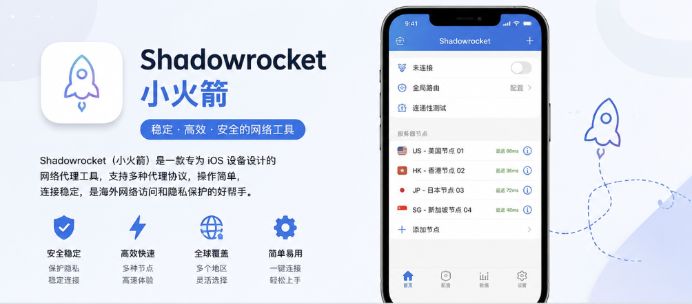
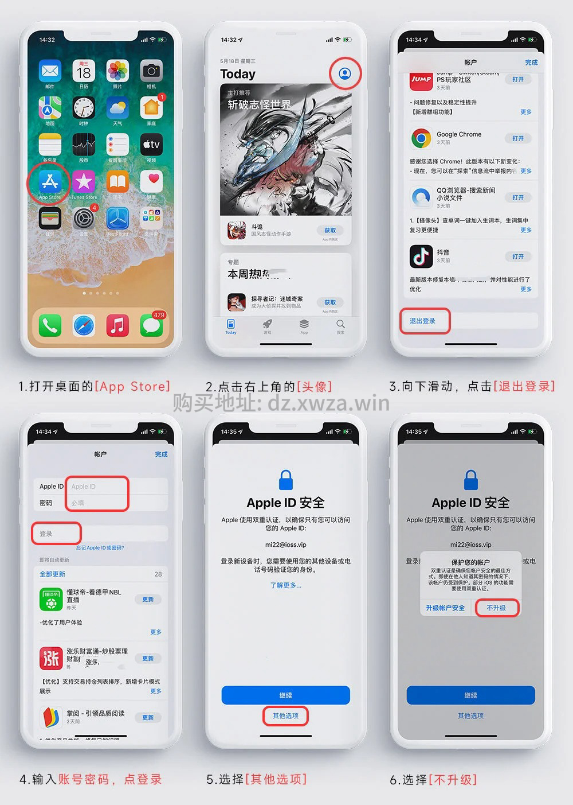

# 小火箭 Shadowrocket 账号分享

Shadowrocket（俗称“小火箭”）是一款运行在 iPhone、iPad 等 Apple 设备上的网络工具，主要用于管理和配置代理连接。

它支持多种代理协议和自定义规则，可以根据域名、IP、地区等条件对不同网络请求进行分流，也可以查看网络请求、流量和连接情况。
对于很多 iPhone 用户来说，Shadowrocket 比较常见的用途就是：

- 配置自己的代理节点
- 导入订阅或规则
- 根据不同网站和 App 设置分流
- 查看当前连接、流量和网络情况
- 在不同网络环境下使用不同的连接配置

需要注意的是，**Shadowrocket 只是客户端，本身不提供代理服务器或节点**。安装 App 后，还需要自行配置相应的网络服务。官方 App Store 页面也明确说明了这一点。

Shadowrocket 目前支持 iPhone、iPad、Mac、Apple TV 等 Apple 平台

如果只是想下载安装 Shadowrocket，可以使用下面整理的共享 Apple ID 临时下载。

## 小火箭账号分享

这里提供部分可免费下载安装的小火箭账号：

- **美国**
  - 账号：`AllenMillie...@gmail.com`
  - 密码：`44s41NP3MD5pf3`

- **英国**
  - 账号：`18235265599@163.com`
  - 密码：`KtmUVf28h`

- **美国**
  - 账号：`DeborazpiHarr967@icloud.com`
  - 密码：`x5Qt9ch9m9`

- **中国**
  - 账号：`JennyLucero216Flk@outlook.com`
  - 密码：`68cGhmsHEn`

共享免费账号用的人很多，你看到的时候不一定能用。可以关注后续分享，或者购买独享账号前往👉 小王子杂货铺（https://dz.xwza.win/）
登陆教程如图!

⚠️ 使用注意事项
仅用于 App Store 下截，不要登录 iCloud
不要修改账号密码，不要修改账号安全设置
多人同时使用时，可能出现暂时无法登录的情况
如果当前账号无法使用，请关注后续更新或者购买独享账号
小火箭账号和订阅节点是两回事，有账号不代表自带节点，需要根据自己的实际需求选择。

小火箭及订阅节点购买请前往👉小王子杂货铺（https://dz.xwza.win/）

如果你想了解更多  Apple ID 的使用技巧、海外 App 下载方法以及常见问题记得关注本站。

